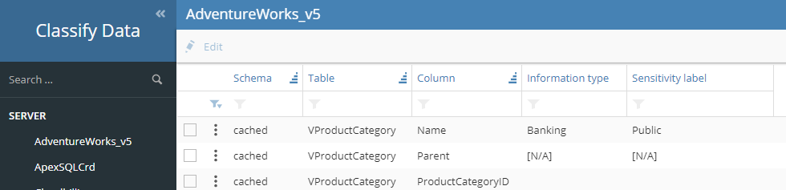
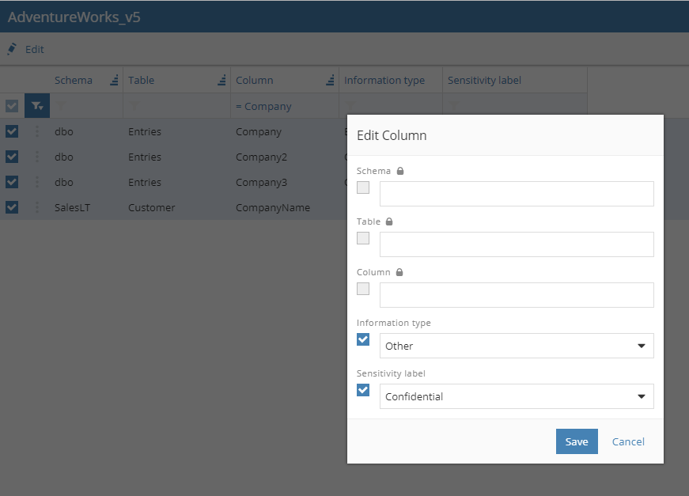

# classify-data
Helper application to use bulk operations on SQL Server's classify data.

## Running the application from source

The application requires Visual Studio 2017 (Community or higher) to open the ClassifyData.sln solution file. If needed the web.config needs to be changed (it currently points to server . aka local using integrated security).

Launching the web project should download all needed NuGet packages and open your default browser.

In the menu it should show a list of all available databases (if not you might need to check the connection string):

Selecting a database on the left will show all columns on the right, you can open a single row or select multiple to set the information type + sensitivity label in bulk.

You can filter by schema/table/column by clicking right below the column header and either choosing the correct values or by using a partial match.